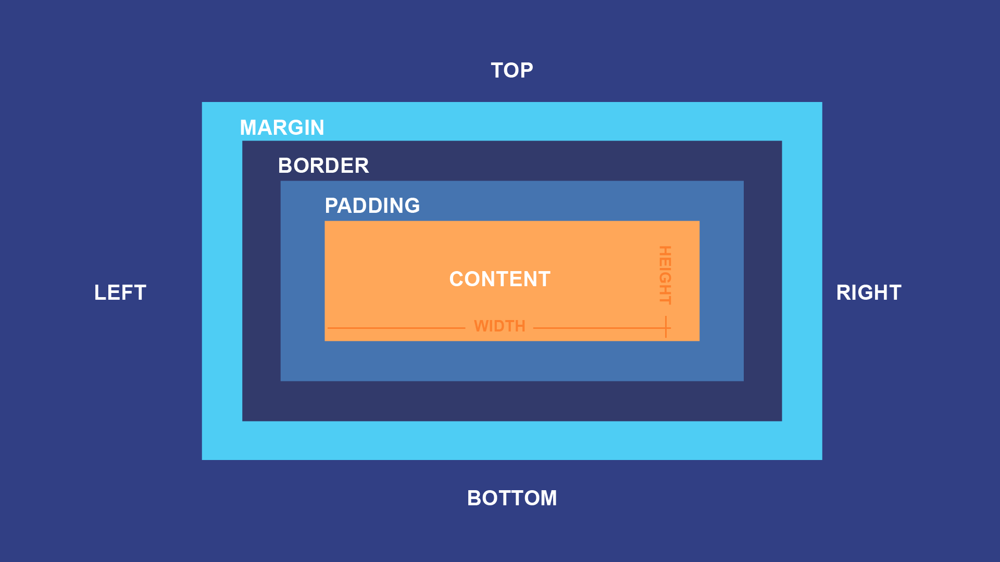

# Giới thiệu CSS
CSS - Cascading Style Sheets, ngôn ngữ tạo phong cách của website dùng để mô tả cách trình bày, bố cụ và phong cách của nội dung trên trang web với mục đích giúp trang web thu hút hơn
# Các cách style trong CSS
- Inline CSS
    - Có thể hiểu là thuộc tính CSS được gắn trực tiếp trong 1 phần tử bằng cách sử thuộc tính `style` trong thẻ HTML
    - Ví dụ:
    ```
    <h1 style="color: red">Hello world!</h1>
    ```

- Internal CSS
    - CSS được đặt trong thẻ `<style></style>` trong phần head của tệp HTML
    - Ví dụ:
    ```
    <!DOCTYPE html>
    <html>
        <head>
            <title>Inline CSS</title>
            <style>
                h1 {
                    color: red;
                }
            </style>
        </head>
        <body>
            <h1>
                Hello world!
            </h1>
        </body>
    </html> 
    ```
- External CSS
    - 1 file CSS riêng biệt bao gồm những thuộc tính tạo kiểu với giúp đỡ của các attributes (class, id,...)
    - Thuộc tính CSS sẽ được đặt trong 1 file với phần mở rộng là .css
    - Được sử dụng thông qua thẻ `link`
    - Ví dụ: file `style.css`
    ```
        <h1>
            Hello world!
        </h1>
    ```
    file `index.html`
    ```
        <!DOCTYPE html>
    <html>
        <head>
            <title>Inline CSS</title>
            <link rel="stylesheet" href="style.css"/>
        </head>
        <body>
            <h1>
                Hello world!
            </h1>
        </body>
    </html> 
    ```

- Độ ưu tiên CSS <br>
`!important`->inline CSS->internal CSS->external CSS
# Comment trong CSS
- Chú thích sẽ được trình duyệt bỏ qua, không hiển thị trên trang web
- Chú thích 1 dòng hoặc nhiều dòng: /* ........ */
- Phím tắt: Ctrl + /
# Các thuộc tính trong CSS
### 1. Text formatting
- Text Color: thiết lập màu <br> `color: red / #000 / rgb(255, 0, 0)`

- Text alignment: căn chỉnh theo chiều ngang <br> `text-align: left / right / center / justified`

- Text decoration: thêm hoặc xóa trang trí <br> `text-decoration: underline / overline / line-through / none`

- Test transformation: thay đổi hình dạng <br> `text-transform: uppercase / lowercase / capitalize`

- Letter spacing: tùy chỉnh khoảng cách giữa các kí tự <br> `letter-spacing: size`;

- Line height: thiết lập khoảng cách giữa các dòng <br> `line-height: size`

- Word spacing: tùy chỉnh khoảng cách giữa các chữ <br> `word-spacing: size`

- Font family: thiết lập phông chữ <br> `font-family: `

- Font size: thiết lập kích cỡ chữ <br> `font-size: size`

### 2. Units 
- Absolute lengths (Độ dài tuyệt đối)
    - Các đơn vị độ dài tuyệt đối là cố định và độ dài được hiển thị với các đơn vị này sẽ xuất hiện chính xác với kích thước đó
    -  Không khuyến nghị sử dụng khi chưa biết được chính xác kích thước của màn hình
    - `cm / mm / in / px* / pt / pc`
- Relative lengths (Độ dài tương đối)
    - Đơn vị độ dài tương đối có độ dài tương ứng với thuộc tính độ dài khác
    - Đơn vị độ dài này có tỷ lệ tốt hơn giữa các phương tiện hiển thị khác nhau
    - `em / ex / ch / rem / vw / vh / %`

### 3. Box model (width, height, margin, padding, border) 

Trình duyệt web hiển thị mọi phần tử dưới dạng hình chữ nhật. Hình hộp chữ nhật này gồm 4 thành phần:
- Content 
    - Thuộc `width` và `height` dùng để xác định chiều rộng và chiều cao cho phần từ
        - `length`: Set giá trị tùy chỉnh với đơn vị: px, cm, etc, vh, vw..
        - `auto`: Giá trị mặc định theo trình duyệt
        - `%`: Set giá trị theo phần trăm của phần tử cha
        - `initial`: Set theo giá trị mặc định của nó
        - `inherit`: Set theo giá trị kế thừa từ phần tử cha
    - `min-width / max-width`: xét chiều dài tối thiểu, tối đa
    - `min-height / max-height`: xét chiều cao tối thiểu / tối đa
- Padding
    - `padding-top`
    - `padding-right`
    - `padding-bottom`
    - `padding-left`
    
    Tất cả các thuộc tính padding này có thể có các giá trị như sau:
    - `length`: `px / pt / cm / ...`
    - `%`: tùy chỉnh padding theo % chiều rộng của phần tử chứa nó
    - `inherit`: kế thừa từ cha

    Short-hand syntax:
    - `padding: 5px 10px 15px 20px` - top right button left
    - `padding: 25px 50px 75px` - top right/left button
    - `padding: 25px 50px` - top/bottom - right/left
    - `padding: 25px` - all

- Border
    - `border-style`: tạo kiểu cho border - `dotted / dash / solid / double / none /...`
    - `border-width`: thiết lập chiều dài của các viền
    - `border-color`: xác định màu cho viền
    - border shorthand syntax

        `border: border-width border-style (required) border-color`
    - `border-radius`: bo tròn viền
- Margin

    - `margin-top`
    - `margin-right`
    - `margin-bottom`
    - `margin-left`

    Tất cả các thuộc tính margin này có thể có các giá trị như sau:
    - `auto`: trình duyệt sẽ tự động tính toán
    - `length`: `px / pt / cm / ...`
    - `%`: tùy chỉnh margin theo % chiều rộng của phần tử chứa nó
    - `inherit`: kế thừa từ cha

    Short-hand syntax:
    - `margin: 5px 10px 15px 20px` - top right button left
    - `margin: 25px 50px 75px` - top right/left button
    - `margin: 25px 50px` - top/bottom - right/left
    - `margin: 25px` - all

-> Sử dụng thuộc tính `box-sizing: border-box` thì chiều dài và chiều cao của element sẽ bao gồm cả padding và border

### 4. Display (block, inline, inline-block)<br>
### 5. Color and Background <br>
### 6. Float
